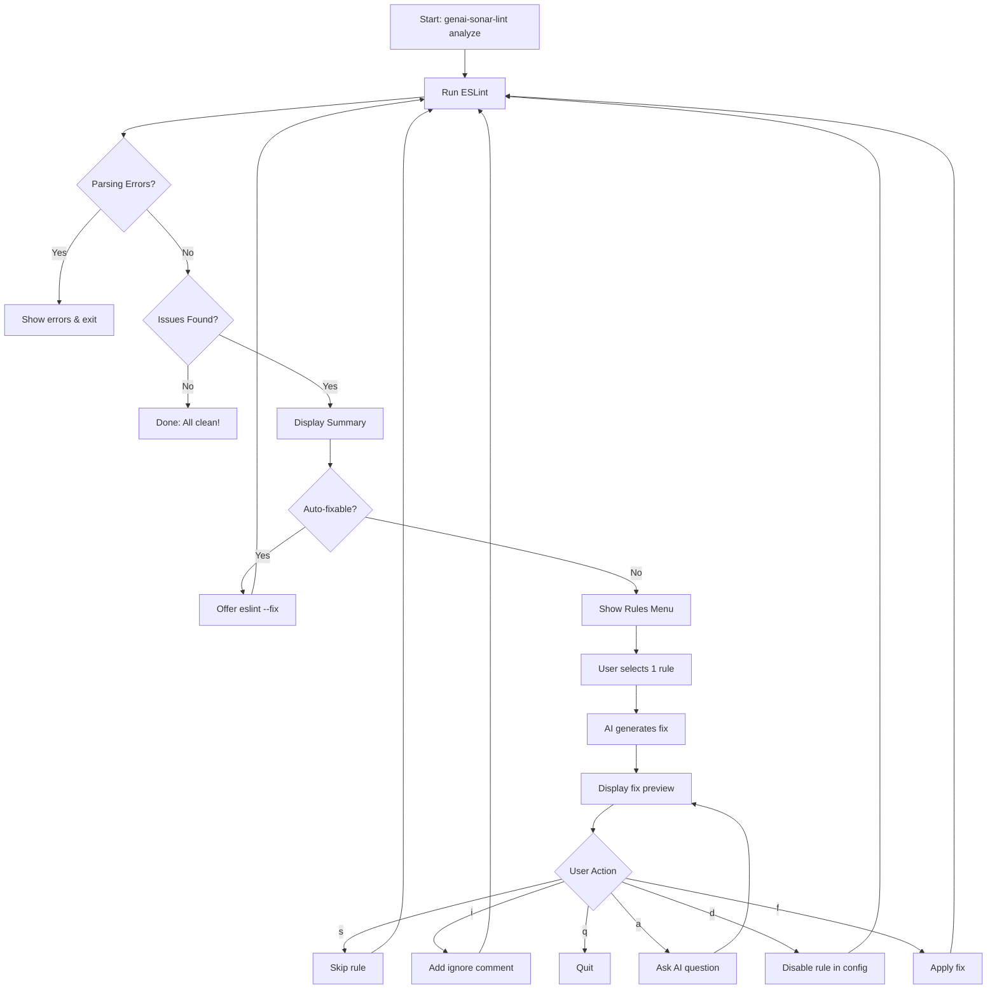

# genai-sonar-lint

AI-powered ESLint/SonarJS analyzer and fixer using Claude Code or Cursor CLI.

[](https://www.npmjs.com/package/genai-sonar-lint)
[](https://opensource.org/licenses/MIT)
[](https://github.com/Seungwoo321/genai-sonar-lint)

## Features

- **Rule-by-rule processing** - Process one ESLint rule at a time for accurate line tracking
- **AI-powered fixes** - Generate context-aware code fixes using Claude Code or Cursor CLI
- **Content-based matching** - Apply fixes using content matching instead of line numbers
- **Auto-fix integration** - Run `eslint --fix` for auto-fixable issues first
- **Multiple fix options** - Apply code fix, disable rule, or add ignore comments
- **Interactive workflow** - Review, ask questions, and refine before applying

## How It Works



## Prerequisites

You need at least one of these AI CLI tools installed:

- [Claude Code CLI](https://docs.anthropic.com/en/docs/claude-code) - Anthropic's official CLI
- [Cursor Agent CLI](https://www.cursor.com/) - Cursor's agent CLI (command: `agent`)

## Installation

```bash
# Global installation
npm install -g genai-sonar-lint

# Or use directly with npx (no installation required)
npx genai-sonar-lint analyze src/
```

## Usage

### Analyze and Fix Issues

```bash
# Using Claude Code (default)
genai-sonar-lint analyze src/

# Using Cursor Agent
genai-sonar-lint analyze src/ -p cursor-cli

# With specific model
genai-sonar-lint analyze src/ -p cursor-cli -m claude-4.5-sonnet

# Non-interactive mode (just show summary)
genai-sonar-lint analyze src/ --non-interactive

# Raw ESLint output (JSON)
genai-sonar-lint analyze src/ --raw

# Save results to file
genai-sonar-lint analyze src/ -o report.json
```

### Auto-fix with ESLint

```bash
# Run eslint --fix directly
genai-sonar-lint fix src/
```

### Authentication

```bash
# Login to Cursor Agent
genai-sonar-lint login cursor-cli

# Setup Claude token
genai-sonar-lint login claude-code
```

### Check Status

```bash
# Check ESLint config and provider availability
genai-sonar-lint status
genai-sonar-lint status -p cursor-cli
```

### List Supported Models

```bash
# List models for Cursor Agent
genai-sonar-lint models cursor-cli

# List models for Claude Code
genai-sonar-lint models claude-code
```

## Interactive Actions

After selecting a rule and generating AI fixes, you'll see an interactive menu:

| Option | Description | Type |
|--------|-------------|------|
| `[f]` | Apply AI-generated fix | Deterministic |
| `[d]` | Disable rule in ESLint config | Deterministic |
| `[i]` | Add eslint-disable comment (line or file) | Deterministic |
| `[a]` | Ask AI additional questions | Non-deterministic |
| `[s]` | Skip this rule | Deterministic |
| `[q]` | Quit | Deterministic |

## Options

| Option | Description | Default |
|--------|-------------|---------|
| `-p, --provider <provider>` | AI provider (claude-code or cursor-cli) | `claude-code` |
| `-m, --model <model>` | Model to use | `claude-4.5-sonnet` (Cursor) / `haiku` (Claude) |
| `-o, --output <file>` | Save results to JSON file | - |
| `-r, --raw` | Output raw ESLint results | `false` |
| `-n, --non-interactive` | Run without interactive mode | `false` |
| `-d, --debug` | Enable debug mode | `false` |

## Example Workflow

### 1. Basic Analysis

```bash
# Navigate to your project
cd my-project

# Run analysis
genai-sonar-lint analyze src/
```

### 2. Interactive Fix Session

```
[Iteration 1] Running ESLint...

════════════════════════════════════════════════════════════════
                    SonarLint Analysis Summary
════════════════════════════════════════════════════════════════

📊 Summary (ESLint results)
   Total issues: 15 (errors: 3, warnings: 12)
   ├─ Auto-fixable: 5 (eslint --fix)
   └─ Manual fix: 10 (AI assisted)
   Unique rules: 4

📦 5 auto-fixable issues found.
Run eslint --fix first? [Y/n] y

[Iteration 2] Running ESLint...

════════════════════════════════════════════════════════════════
              Select a Rule to Process
════════════════════════════════════════════════════════════════

  [1] sonarjs/no-duplicate-string (warning) - 5 issues [manual]
  [2] sonarjs/cognitive-complexity (error) - 3 issues [manual]
  [3] @typescript-eslint/no-explicit-any (warning) - 2 issues [manual]

Enter rule number to process, or [q] to quit:
> 1
```

### 3. Review and Apply Fix

```
════════════════════════════════════════════════════════════════
  Rule 1/1
════════════════════════════════════════════════════════════════

📋 Rule: sonarjs/no-duplicate-string (5 issues)
⚠️  Severity: warning | Priority: medium

── AI Analysis ──────────────────────────────────────────────────
🔴 Problem: The same string literal appears multiple times
❓ Why: Duplicated strings are harder to maintain and may cause bugs
✅ How to fix: Extract to a constant or configuration

── [f] Fix Preview (AI generated) ───────────────────────────────
📍 utils.ts:15-15
   Original:
   - const type = 'application/json';
   Fixed:
   + const CONTENT_TYPE = 'application/json';
   └ Extracted duplicate string to constant

────────────────────────────────────────────────────────────────
  [f] Fix      - Apply AI-generated fix          [deterministic]
  [d] Disable  - Apply config change             [deterministic]
  [i] Ignore   - Add eslint-disable comment      [deterministic]
  [a] Ask AI   - Ask additional questions        [non-deterministic]
  [s] Skip     - Skip this rule                  [deterministic]
  [q] Quit     - Exit                            [deterministic]
────────────────────────────────────────────────────────────────
> f
```

## Supported ESLint Rules

Works with any ESLint rules including:

- **SonarJS** - Code smell detection
- **TypeScript ESLint** - TypeScript-specific rules
- **ESLint core** - Standard JavaScript rules
- **React/Vue/Angular** - Framework-specific rules

## Why Rule-by-Rule Processing?

Traditional batch processing generates fixes for all rules at once, but this causes problems:

1. **Line number invalidation** - When one fix is applied, line numbers shift
2. **Cascading failures** - Later fixes may target wrong lines
3. **Complex conflict resolution** - Multiple fixes may conflict

Our approach:

1. Run ESLint → Get fresh results
2. Select ONE rule to fix
3. Generate AI fix with current line numbers
4. Apply fix (content-based matching)
5. Loop back to step 1

This ensures every fix is generated against the current state of the code.

## Configuration

The tool uses sensible defaults:

| Setting | Default | Description |
|---------|---------|-------------|
| `maxBuffer` | 10MB | Maximum ESLint output buffer |
| `codeContext` | ±10 lines | Lines of context for AI analysis |
| `timeout` | 120000 | AI request timeout in ms |

## Requirements

- Node.js >= 18.0.0
- ESLint configured in your project
- Claude Code CLI or Cursor CLI installed and authenticated

## License

MIT
